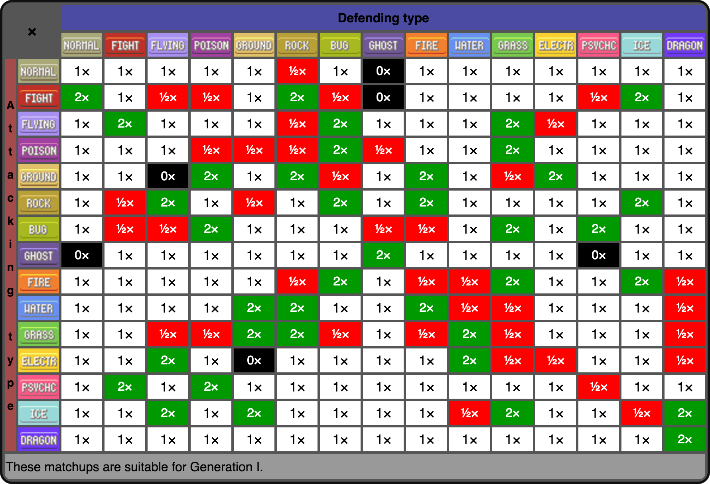

# Pokemon Type Battles

Simulate what happens when each square is a pokemon type and they battle each other according to the pokemon type chart. Inspired by [this tweet](https://twitter.com/matthen2/status/1543226572592783362).

# Usage

Download the repository. You need to have python available with numpy and pygame. Then:

```
python pokemon-ising.py
```

## Export to video

You can also save each frame as a picture with

```
python pokemon-ising.py --export DIR
```

where `DIR` is the name of the directory where the frames will be saved. Then you can make a video out of them with [ffmpeg](https://ffmpeg.org/):

```
ffmpeg -framerate 20 -pattern_type glob -i "DIR/frame_*.png" output.mp4
```
# Examples


# Type Chart Reference


